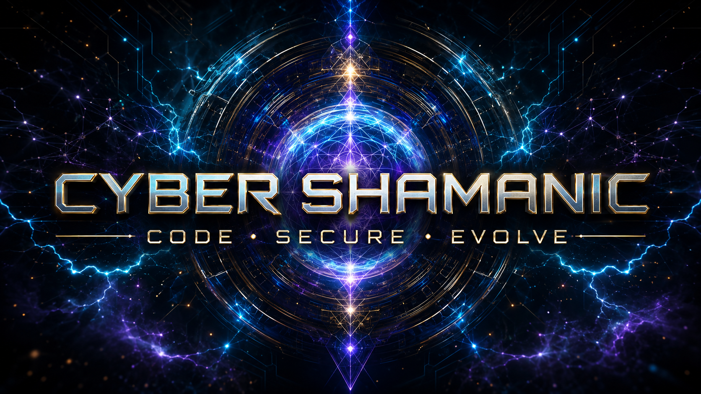

<div align="center">



# ⚡ Cyber Shamanic — Website v0.0.2

### Cybersecurity • AI • Automation • OSINT • Web • Open Source

**Technology becomes powerful when guided by wisdom.**

</div>

## 🌐 פתיחת האתר

פתחו את `index.html` בדפדפן. כל הדפים, המחירון ובונה הצעת ה־WhatsApp פועלים
גם ישירות מתוך התיקייה, ללא התקנה או תהליך build.

## 🗂️ מבנה

```text
index.html
about.html
services.html
pricing.html
projects.html
contact.html
assets/
  css/site.css
  images/hero-cyber-shamanic.png
  images/logo-cs.png
  images/readme-cover.png
  favicon.ico
functions/
  main.js
  services-data.js
  pricing.js
  whatsapp.js
```

## ✨ תכונות

- שישה דפי HTML עצמאיים.
- עיצוב קולנועי־עתידני ורספונסיבי.
- קטלוג של 24 שירותים בשש קטגוריות.
- תיבות סימון, חישוב מחיר ואומדן בזמן אמת.
- יצירת הודעת WhatsApp מעוצבת עם פרטי הלקוח והשירותים שנבחרו.
- לוגו, favicon, Hero ותמונת README.
- תמיכה במקלדת, מצב reduced motion ו־SEO בסיסי.

## 📬 קשר

- [WhatsApp](https://wa.me/972535366687)
- [Email](mailto:cybershamanic@gmail.com)
- [GitHub](https://github.com/Cyber-Shamanic)

## 🗓️ גרסה וקרדיטים

- Version: `0.0.2`
- תאריך עברי: י׳ באב תשפ״ו
- תאריך לועזי: 24 ביולי 2026
- יצירה ומיתוג: [Cyber Shamanic](https://github.com/Cyber-Shamanic)

> ״וְאֹרַח צַדִּיקִים כְּאוֹר נֹגַהּ, הוֹלֵךְ וָאוֹר עַד נְכוֹן הַיּוֹם״ — משלי ד׳, י״ח
